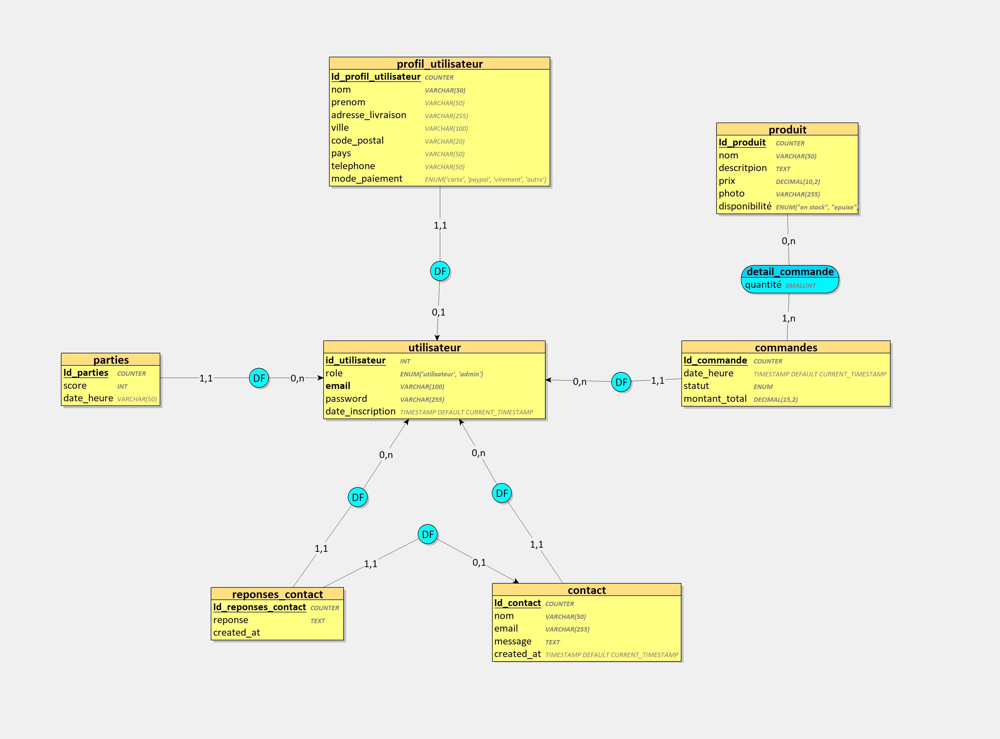

# Orb'E - Site Web & Mini-Jeu
- Presentation du projet dans le dossier Presentation
  
## Description
Orb'E est un assistant personnel intelligent sous forme de sphère. Ce projet de site web vise à promouvoir Orb'E en intégrant un mini-jeu interactif permettant aux utilisateurs de gagner des réductions en fonction de leurs scores.


## Technologies Utilisées
### Frontend
- `HTML`, `CSS`, `JavaScript`
  
### Backend
- `PHP (MVC)`
- `MySQL` pour la base de données

## Installation
1. **Cloner le dépôt**
   ```bash
   git clone https://github.com/utilisateur/OrbE-Site.git
   ```
2. **Configurer la base de données**
   - Executer le fichier creationBDD.sql dans votre base de donné 
  

3. **Installer Composer**
   -npm init
   -composer install

4. **Preparer un fichier .env à la racine**
   - DB_HOST=
   - DB_NAME= 
   - USERNAME= 
   - PASSWORD=
   
5. **Lancer le serveur local**
   - Utiliser XAMPP ou un autre serveur PHP

6. **Schema E/A**
 

